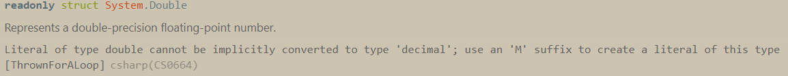

# Doubles and Decimals
In this chapter we're going to (1) change the Price property to use the `decimal` type, (2) add a `Condition` property to the `Product`s to rate the wear-and-tear on them, and (3) display the total value of the inventory to the user.

Learning Objectives:
1. Declaring and initializing `double` and `decimal`
1. Understanding the difference between these two types and integers
1. Performing calculations with number types. 
1. Iterating through a `List` with `foreach`.

## Adding a `Condition` property to `Product`
The manger of Thrown For a Loop would like to record the condition of the used equipment items that are in stock. The condition is graded on a scale of 1-5, and the manager wants to be able to use non-integer values (3.4, 4.8, etc...)

Add another property to the `Product` class called `Condition`:
```csharp
public double Condition { get; set; }
```
In your products list, add floating point values for the condition of of the items in the products list. Here's one:
``` csharp
new Product() 
{ 
    Name = "Football",
    Price = 15,
    Sold = false,
    StockDate = new DateTime(2022, 10, 1),
    ManufactureYear = 2010, 
    Condition = 4.2
}
```
Add to the string at the bottom of the program to also display the condition of the product when showing its details. 

## Representing prices as decimals

Not all of the prices of our items will be integers, so let's change the type of `Price` to `decimal` in `Product.cs`:
```csharp
public decimal Price { get; set; }
```
Now, we can represent our prices like this:
```csharp
new Product()
{
    Name = "Football",
    Price = 15.00,
    Sold = false,
    StockDate = new DateTime(2022, 10, 1),
    ManufactureYear = 2010, 
    Condition = 4.2
}
```

Uh oh. What happens when we do that? You should see a compiler error (hover over a number with a red squiggle under it) looking something like this:

The reason this happens is that the C# compiler reads that `15.00` as a `double` value, and doesn't allow you to convert from one to the other (the reason for that is something you don't need to know right now). The message tells us to add an `M` at the end of the value to indicate to the compiler that our number is a `decimal`, and not a `double`, so let's do that:
``` csharp
new Product()
{
    Name = "Football",
    Price = 15.00M,
    Sold = false,
    StockDate = new DateTime(2022, 10, 1),
    ManufactureYear = 2010, 
    Condition = 4.2
}
```

Now our compiler errors should go away! Update all of the prices in the products list and run the program to make sure it still works. 
> **When to use different numeric types?** <br> It can be confusing to know what numeric type is appropriate for a specific use case. In general for this course, the following guidelines may be helpful: <br> 1. If it's possible to use an `int`, prefer that option. <br> 2. If a floating point type is necessary, and you need to do calculations with those numbers that require very precise results (like calculating interest, anything dealing with money, etc.) use the `decimal` type. <br> 3. Otherwise, use a `double`

## Displaying the Total Value of the current stock
The manager of the store would like to see the current value of the entire stock when looking at the products list. For that, we need to add up the prices of all of the items that are currently in stock. After displaying the initial greeting, add the following code:
``` csharp
decimal totalValue = 0.0M;
foreach (Product product in products)
{
    if (!product.Sold)
    {
        totalValue += product.Price;
    }
}
Console.WriteLine($"Total inventory value: ${totalValue}");
```
The above code does the following things:
1. It declares a variable called `totalValue` of type `decimal` with an initial value of zero, to accumulate all of the product values. 
1. The `foreach` loop checks each product to see if it is not sold. If it is still in stock, the price of that item is added to the total. 
1. Finally, the last line prints the total to the console. 

### The syntax for a `foreach` loop
One striking thing about the code above is the seeming repetitiveness of `Product product in products`, so let's break that statement down:

1. `Product product` - `product` (lower case `p`) is the local variable that will hold the value of item that the loop is on. Because we are _declaring_ a variable, we have to give it a type, just like we would to declare a variable outside of the loop. So `Product` (capital `P`) is the type of the variable `product`. In JS this would be `let product` 
1. `products` is just a reference to the list of products we declared at the top of the file. We use `in` instead of `of` to indicate that this is the List we are looping through. 

The JS for the above syntax would be:
``` javascript
for (let product of products)
```

Run the program again to ensure that you are getting the correct tally for your inventory (remember that sold items will be excluded!)

Up Next: [Handling Exceptions](./handling-exceptions.md)

## 🔍 Additional Materials
1. [Numbers in C#](https://learn.microsoft.com/en-us/dotnet/csharp/tour-of-csharp/tutorials/numbers-in-csharp-local)