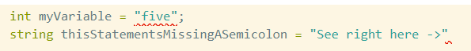

# Handling Exceptions
In this chapter we will handle a runtime error that is thrown when a user gives input that can't be used by the program.

Learning Objectives:
1. The difference between compiler errors and runtime Exceptions
1. using `try`/`catch` to handle potential Exceptions
1. capturing the Exception value with a variable (`Exception ex`)

## Compiler errors vs. runtime Exceptions
Chances are you have already encountered both compiler errors and runtime exceptions in this part of the course. Practically, you can easily tell the difference between them: compiler errors will show up highlighted in your editor with squiggles under them. There is a program called OmniSharp that is running in the background, and using the C# compiler to check your code for these errors (it's part of the C# extension you installed for VS Code). You can also see a list of compiler errors in the terminal if you run `dotnet build` or `dotnet run` and your program has errors in it.  These are usually syntax or type errors, like missing semicolons, or assigning a `string` as the value of an `int` variable. 


Runtime exceptions occur when a problem happens with the code that isn't obvious from the syntax of the code. For applications with users and user input, this often happens because some unanticipated input is provided by the user, and it causes the code to not be able to move forward. The classic example is dividing by zero. Let's say we have a calculator program to divide two numbers. The divide program looks like this:
```csharp
Console.WriteLine("Please input divisor:");
int divisor = int.Parse(Console.ReadLine()); 
Console.WriteLine("Please input dividend:");
int dividend = int.Parse(Console.ReadLine());
Console.WriteLine($"{dividend} / {divisor} = {dividend /  divisor}");
```

This program will work fine unless the user provides `0` for the input. Because the compiler can't anticipate this from the syntax, the code is perfectly valid. But, given that input from the user,  the program will _throw_ a runtime exception that looks like this in the terminal:
```
Unhandled exception. System.DivideByZeroException: Attempted to divide by zero.
   at Program.<Main>$(String[] args) in C:\Users\jimbob\workspace\csharp\Divider\Program.cs:line 5
```
Let's break this message down:
1. The first part of this message says `Unhandled exception`. It says _unhandled_ because the code has not anticipated the situation.  The big problem with an exception being unhandled is that it causes the program to stop running. That's not such a problem for this little program, but imagine an app that many users were using on the web. Depending on how it is configured, it might suddenly stop working for everyone!
1. The second part `System.DivideByZeroException` gives the specific type of exception that was thrown. Yes, even the errors have types in C#!  Knowing what type of error was thrown is often helpful in googling a solution, but as we'll see below, also very helpful in deciding what to do when the error happens. 
1. After the colon, we have `Attempted to divide by zero.`  This is a human-readable message that explains what the most immediate concern is. In this case, it is pretty obvious what the problem is. 
1. Finally, starting with the word `at`, we have the _stacktrace_. This is very helpful, because as you can see at the end of the line, the trace tells us what line threw the error, and in which file. When you start using the debugger, you might put a breakpoint here to see what the program's state was right before the error is thrown. IMPORTANT NOTE: In more complicated programs, the stacktrace will have more lines in it than this. Most of the time, the top line of the trace (and the file name and line number in it) are going to be the most (or only) relevant information for solving your problem. 

> It is very common for beginners to be bewildered by exception messages. That's ok! They can look intimidating. However, try to break each exception message you see down to these four pieces and mine them for data to help solve your problem. Eventually, exception messages will be your best friend in solving problems with your code. 

## Handling unexpected user input in `ThrownForALoop`

Our program currently only asks for user input once, when choosing an item. The `while` loop already handles the possibility that the user will choose an item out of the range of the number of items (this would trigger an `ArgumentOutOfRangeException` otherwise). But what if the user gives input like "five" or "taco"? Go ahead and try it. You should see something like this:
```
Unhandled exception. System.FormatException: Input string was not in a correct format.
   at System.Number.ThrowOverflowOrFormatException(ParsingStatus status, TypeCode type)
   at System.Int32.Parse(String s)
   at Program.<Main>$(String[] args) in C:\Users\jimbob\workspace\csharp\ThrownForALoop\Program.cs:line 32
```

Let's handle this `FormatException` as well as the `ArgumentOutOfRangeException` with `try`/`catch` logic. Replace all of this code:
``` csharp 
Console.WriteLine("Please enter a product number: ");
int response = int.Parse(Console.ReadLine().Trim());

while (response > products.Count || response < 1)
{
    Console.WriteLine("Choose an existing product number!");
    response = int.Parse(Console.ReadLine().Trim());
}

Product chosenProduct = products[response - 1];
```
with this code:
```chsarp
Product chosenProduct = null;

while (chosenProduct == null)
{
    Console.WriteLine("Please enter a product number: ");
    try
    {
        int response = int.Parse(Console.ReadLine().Trim());
        chosenProduct = products[response - 1];
    }
    catch
    {
        Console.WriteLine("Do better!");
    }
}
```

The logic of the program has changed a bit. Our while loop runs so long as `chosenProduct` hasn't been set. When it runs the first time, it asks the user for a product number. The `try` section of code then runs. If any of the code inside the `try` part throws an Exception, instead of shutting down the program, it runs the code in the `catch` section instead. Go ahead and try the program with both of our problematic cases (entering a non-integer, or choosing an integer that doesn't match a project).  Both cases should cause `Do Better!` to be printed to the screen, and then the while loop will run again.

One problem with this is that once the Exception happens, we can't see the error message that was handled. We can capture the Exception value in the catch like this:
```csharp
catch (Exception ex)
{
   Console.WriteLine(ex);
   Console.WriteLine("Do better!");
}
```
Try our edge cases again, and you'll see the same error message as if it were unhandled, except that you won't see `Unhandled exception.` at the beginning of the message, and you'll notice that the program keeps running! yay. 

## Handling specific Exceptions in different ways
Often you will want to enclose a bunch of code in `try` but handle different Exceptions that could happen in that block differently. Fortunately, we can tack on more `catch` blocks to handle different Exceptions differently, like this:
``` csharp
try
{
   int response = int.Parse(Console.ReadLine().Trim());
   chosenProduct = products[response - 1];
}
catch (FormatException)
{
   Console.WriteLine("Please type only integers!");
}
catch (ArgumentOutOfRangeException)
{
   Console.WriteLine("Please choose an existing item only!");
}
catch (Exception ex)
{
   Console.WriteLine(ex);
   Console.WriteLine("Do Better!");
}
```

The last `catch` will catch any other general Exceptions that aren't `FormatException` or `ArgumentOutOfRangeException`.  Go ahead and try it, and test all the cases that you can. 

## ✍️ Reflections
1. There are two skills we introduce in this chapter. The first, and for you most important right now, is _how to read Exception messages_. What are the four parts of the Exception message, and what piece of information does each part give you? How can you use them to see what's wrong in your code?
1. The second is how to _handle_ Exceptions, that is, anticipate that some parts of your code might throw errors, and instead of your program breaking, provide alternative logic for it to follow in the `catch`. When would you do this instead of using `if`/`else`? Sometimes there isn't a straightforward answer to this question, so discuss it with your peers!

Up Next: [Methods](./foundations-methods.md)
