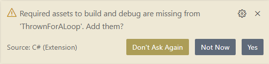
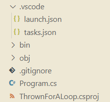

# Intro to working with C# in VS Code 

### Using the .NET CLI to create and run programs
It's time to make your first program! When you installed the .NET SDK (Software Development Kit) it came with the .NET CLI (command line interface). It includes many commands that are helpful for creating, building, and running .NET programs. Anytime you want to run a command using the .NET CLI in your terminal, it will always start with `dotnet`, followed by one or more subcommands. The first one we're going to use is `dotnet new`. 

> You have worked with other CLIs in the front end part of the course already. `npm` allowed you to create a Node project, which created a `package.json` file and gave you the ability to install and maintain dependencies with `npm install` - the .NET CLI will do this as well. Just like `vite` provided a pre-built React app as a template, we will also use the templates that the .NET CLI has available to provide starter code for our .NET projects.  

#### Steps to set up a new C#/.NET console app:
1. create a new directory in your `workspace` directory called `csharp`
1. Inside the `csharp` directory, run `dotnet new console -o ThrownForALoop`
1. The previous command created a new directory called `ThrownForALoop`. `cd` into that directory
1. run `dotnet new gitignore`
1. Open the project in VS Code with `code .`
1. When the project opens in VS Code, you will see a dialog that looks like this:    
1. Click Yes. When you are done, your folder structure should look like this:  
 
1. Open `launch.json` in the `.vscode` folder. Change `"console": "internalConsole"` to `"console": "integratedTerminal"`, and save the file. 
1. Go back to the terminal (if you closed your terminal, return to the directory with `ThrownForALoop.csproj` in it) and run `dotnet run`. You should see "Hello World!" in the console before you see another terminal prompt. 

>**Follow this entire checklist every time you create a new console application for this course.**

#### What did we just do?
The `bin` and `obj` folders that you see in the project contain files that are created by .NET when your code is compiled and run. *During this course you should not need to edit or touch any of the files in these folders, and they should always be gitignored*.

We can use `dotnet new` to start a web app or a web API too, but some of the templates are for smaller units of code, like... a gitignore file! `dotnet new gitignore` creates a gitignore file with all of the relevant files that you don't want to have in your repos (like `bin` and `obj` for example). *Make sure you do this before making any commits in a new repo*. 

The `.vscode` folder includes configuration files for VS Code to run your project and use the debugger (we'll go in depth on that in a few chapters). `integratedTerminal` for the `console` setting in `launch.json` allows the user to interact with the program from the command line while it is running (to give it user input, for example). 

Finally, `dotnet run` will compile our code (if necessary - if there have been no changes since the last run, it won't need to), and then starts the program in our terminal. `Program.cs` is the _entrypoint_ for our application, like `main.js` or `index.js` in a JS program. The program starts at the top of this file and executes line by line. Once the program runs out of code to execute, it will exit. Later on we'll add more files, but this is all you need to know for now!

Up Next: [User Interaction in the Console and working with strings](./interacting-with-console.md)