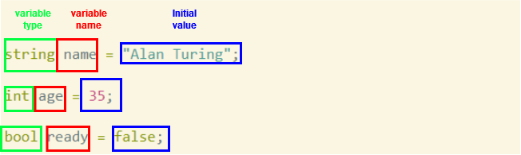
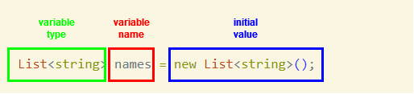

# Lists
In this chapter we will store our products inside a `List` instead of a string. 

Learning Objectives:
1. Declaring and initializing variables with the `List<T>` type
1. Adding items to a List
1. Accessing a List member by index
1. Checking the length of a `List` with `Count`
1. Iterating through a List with `for`

## Declaring variables
Our interaction with the type system is about to get more complicated, so let's review what we've seen so far about declaring variables with different types. 

This is what it looks like to declare `string`, `int` and `bool` type variables:


We can reassign the values of these variables, but only values that are the same type that the variable was declared to hold. So...
``` csharp
name = "Grace Hopper"; //totally fine
name = null; //totally fine - strings can be null
name = 586; //compiler error. 586 is an int, not a string. 

age = 42; //totally fine
age = null // compiler error! a regular int cannot be null.
age = "ten"; //compiler error - "ten" is a string

ready = true; //totally fine
ready = "true"; //compiler error, "true" is a string, not a bool
ready = null; //compiler error - bools cannot be null.
```
If you haven't already, this is a good time to notice that many types in C# are not nullable by default, that is, `null` is not a valid value for them. 

## Initializing a List
The `List` type in C# is the type you will use where you would have used an `Array` in Javascript. Even though they have different method and property names, they overlap significantly in functionality. 
This is an example of creating a new List:
``` csharp
List<string> names = new List<string>();
``` 
Suddenly, we've departed significantly from JS in syntax, but if we break down this statement it is the same as the other types above, with the same pieces:


You've probably noticed that there are two types in the type definition for the `names` variable, `List`, and `string`. The type inside the `<>` angle braces indicates what type all of the items in the List will be. This names list will only have strings in it. 

On the right side of the equals sign we have something that looks very similar to the type, but with the `new` keyword in front of it, and `()` after it. `new` followed by a type creates a new _instance_ of that type. The parentheses after the type name are there because `new` actually calls a special kind of method (called a constructor) to make a new one of the type it's creating. Sometimes we will pass arguments into those parentheses, but more often we won't. The equivalent JS of the above code is:
``` javascript
let names = [];
```
> <sub>Yes, yes, I know that seems a lot cleaner and easier to read, but our verbose C# will come in handy soon enough. For one, there's nothing stopping you from adding whatever data types you like to the JS array `names`, even mismatching ones. That's almost never what you want to do (if you have ever seen a bug that was caused by a data value of `"1"` when you were expecting `1`, or an object missing a critical key in an array of those objects, you know what I mean).  Our long syntax for creating this List of integers gives us _type safety_. That can be very helpful in preventing bugs in our programs.</sub> 

### Initialize a List with values
We can also create a new List, and immediately add items to it with the _collection initializer_. This is a pair of curly braces that comes after the parentheses, like this:
``` csharp
List<int> years = new List<int>()
{
    1985, 
    2022,
    1999,
    1976
};
```
The equivalent JS is:
``` javascript
let years = [
  1985, 
  2022,
  1999,
  1976
];
```

Ok, back to our project... 

## Organizing the data for Thrown For A Loop

It doesn't really make sense for our list of products to be stored in the prompt that asks our user to choose one. A data collection like a `List` will allow us to manage that data and change it more easily. Let's add that to the top of our program now:
```csharp
List<string> products = new List<string>()
{
    "Football",
    "Hockey Stick",
    "Boomerang",
    "Frisbee",
    "Golf Putter"
};
```
The code above creates a new `List`, adds the five items to it that are in the _collection initializer_ (the curly braces that come after the parentheses), and saves that List in a variable called `products`. 

### Iterating through a List with a `for` loop
Now we can use our list of products to display them in the console with a for loop. Take out the list of products from the prompt so that it looks like this:
``` csharp
Console.WriteLine("Products:");

Console.WriteLine("Please enter a product number: ");
```
Now, in between those two lines of code, you can iterate through the list and write each of the products to the console in the loop:
``` csharp
for (int i = 0; i < products.Count; i++)
{
    Console.WriteLine($"{i + 1}. {products[i]}");
}
```
This loop's syntax is almost identical to the syntax in a JS `for` loop, but it may have been a while since you've seen one, so let's review what each of the pieces does:
1. `int i = 0;` This creates a variable that we can use in the logic of our loop. Notice that because we are declaring a new variable, we provide its type before the name (`int`);
1. `i < products.Count;` This is the condition that, if false, will make the loop stop. This is a good time to point out that `Count` is the property of a list you want to check to see what the length of the list is.
1. `i++` This is an operation that we run at the end of each iteration of the loop. Almost always, this operation increments `i`, which is what it does here!

Run the program to see if it still works. Notice that we added `1` to `i` in the program because non-developer humans are not used to seeing UIs start lists with `0`. Also notice that we can access an item in a `List` by index with _bracket notation_ just like you would in a JS array. 

We also need to change the `5` in our `while` loop to `products.Count` in case our `List` size changes:
``` csharp
while (response > products.Count || response < 1)
```

### Converting our user input to query the List
Now that we can more easily query the data, we can use the user input to get the chosen item from the data:
```csharp
Console.WriteLine($"You chose: {products[response - 1]}");
```
We need to subtract `1` from the user's answer (if they chose option `3`, that will correspond to index `2` in the `List`).

Up Next: [User-Defined Types: Classes](./classes-intro.md)

## 🔍 Additional Materials
1. [Default values for C# types](https://learn.microsoft.com/en-us/dotnet/csharp/language-reference/builtin-types/default-values)
1. [Type Safety](https://en.wikipedia.org/wiki/Type_safety)
1. [`List<T>` Microsoft docs](https://learn.microsoft.com/en-us/dotnet/api/system.collections.generic.list-1?view=net-8.0)
