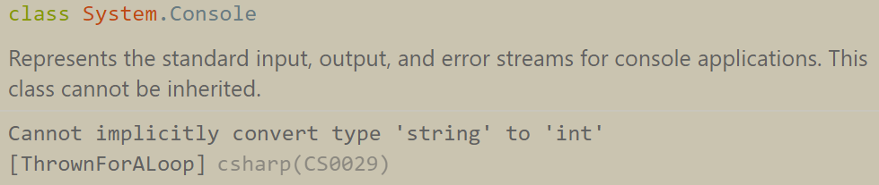

# Working With Integers
Learning Objectives:

1. declaring and assigning integer variables
1. parsing strings as integers

## Choosing a numbered option

It's a lot of work for our user to type out the entire name of a product, and we would be relying on them to type the product name perfectly. Let's allow our user to choose from a menu of options that we provide them. Replace the prompt to choose a product name with this:

``` csharp
Console.WriteLine(@"Products:
1. Football
2. Hockey Stick
3. Boomerang
4. Frisbee
5. Golf Putter");
Console.WriteLine("Please enter a product number: ");
```
We now want to save the user's response as an integer rather than a string. Change the type definition for `response` from `string` to `int`. This says that my `response` variable can't hold string values, it holds integer values. What happened? 

If VS Code is set up correctly with the Microsoft C# extension, you should see a _compiler error_ like this if you hover over the `Console` with the red squiggle on the right side of the `=`:



This means that the compiler is trying to make sense of what's on the right side of the `=` as an integer, and can't do so (because `.Trim()` returns a string). This is because our program has no way of knowing that we're expecting the string that `Trim` returns to be `"1"` or `"5"`, or any number in between. In order to _explicitly_ tell the program to interpret the `string` as an `int`, we can use `int.Parse`, like this:

```csharp
int response = int.Parse(Console.ReadLine().Trim());
```

This works just like `parseInt` in JS: take a string, try to interpret the characters as a `number`. There is one important difference, but we'll get to that later. 

Unfortunately, we still have a few errors from the rest of our program that expect `response` to be a `string`. Our `while` loop doesn't need to worry about `response` being `null` or `empty` (integers can't be either), but it looks like we now want to make sure that the `response` is between 1 and 5. 

Let's change the condition in our `while` loop, and also parse the user's response inside the loop as an `int` as well:
``` csharp
while (response > 5 || response < 1)
{
    Console.WriteLine("Choose a number between 1 and 5!");
    response = int.Parse(Console.ReadLine().Trim());
}
```

This isn't really any different than the way you would write this `while` condition in JS. 

Run the program and see what it does! Test the basic functionality and make sure that it works. Then, test all of the edge cases you can think of. There's at least one that we need to fix - we'll take care of that in a few chapters. 

>It's important to not be afraid to break your program, especially when you're working on something new. The errors you see will eventually be extremely informative to you, and you would rather see them while writing code than see them in the logs of your (broken) deployed application.  Seeing errors is usually great news, because it means you at least have a clue what's wrong. Bugs that don't present as errors are much harder to fix. 

In Javascript, there is only one `number` type. In C# there are many different numerical types (which vary in how big they can be and how precise), and even more than one `int` type. We'll get to some of them later, but if it's possible, most of the time you should use the `int` type for integer values.

Up Next: [Lists](./thrown-for-a-loop-lists.md)

## 🔍 Additional Materials
1. [Microsoft docs for integral types](https://learn.microsoft.com/en-us/dotnet/csharp/language-reference/builtin-types/integral-numeric-types)


