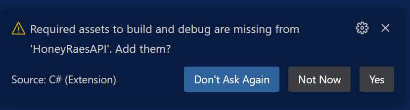

# Creating a new Web API project
In this chapter we will go over the steps for creating a new ASP.NET Core Web API using the Minimal APIs feature. You can use this setup guide for all of the projects in this book. 

Web APIs respond to HTTP requests with HTTP responses. Here are two short videos as a refresher on how HTTP requests and responses are structured:

[Parts of an HTTP request](https://youtu.be/pHFWGN-upGM)

[Parts of an HTTP response](https://youtu.be/c9sMNc2PrMU)

## Instructions

1. Navigate to `~/workspace/csharp` in your terminal
1. Run this command: `dotnet new webapi -o HoneyRaesAPI -minimal`
1. Run `cd HoneyRaesAPI`
1. Run `dotnet new gitignore`
1. Run `dotnet watch run`

When you've finished these instructions, you should see something like this in your terminal, that indicates that the API is running:
```
Building...
info: Microsoft.Hosting.Lifetime[14]
      Now listening on: http://localhost:5256
info: Microsoft.Hosting.Lifetime[0]
      Application started. Press Ctrl+C to shut down.
info: Microsoft.Hosting.Lifetime[0]
      Hosting environment: Development
info: Microsoft.Hosting.Lifetime[0]
      Content root path: C:\Path\To\HoneyRaesAPI
```

Type `Ctrl+C` in the terminal to shut the API down now. 

6. After this, use `code .` to open the project you just created in VS Code. 

6. You should see this dialog from VS Code (click Yes):


## A tour of the scaffolded project

### What's the same
Just like any .NET project, there is a `csproj` file that contains important data about the project, including the .NET version. 

There is also a `Program.cs` file, which is the entrypoint to the application, just like it was with the console applications

### What's different

In the `csproj` file, you'll notice that there are `PackageReference` nodes for something called `Swashbuckle` and `OpenApi`. Package references in .NET are a lot like dependencies in the `package.json` file in an npm project. They are references for outside libraries and projects that your project needs to work correctly. This particular library will help you create a nice little UI in the browser to test your API. There is an explorer chapter with a tutorial in its use. 

There are two more new files called `appsettings.json` and `appsettings.Development.json`. They hold configuration data for the application that gets used when starting the app. We will use these files later, but you can leave them alone for now.

The `Properties` folder holds a file called `launch.json`. This file holds configuration settings for launching the app (this is where you can find the urls you can use to access the app in Postman or a browser).
 
`Program.cs` looks _very_ different from our console app template. Let's use the code that is there to introduce some important concepts in building web APIs. 

### A detailed tour of `Program.cs` 

``` csharp
var builder = WebApplication.CreateBuilder(args);

// Add services to the container.
// Learn more about configuring Swagger/OpenAPI at https://aka.ms/aspnetcore/swashbuckle
builder.Services.AddEndpointsApiExplorer();
builder.Services.AddSwaggerGen();

var app = builder.Build();

// Configure the HTTP request pipeline.
if (app.Environment.IsDevelopment())
{
    app.UseSwagger();
    app.UseSwaggerUI();
}

app.UseHttpsRedirection();
```

All of the code above is setting up the application to be ready to serve as a web API. We will edit some parts of this code later when we want to change the app's behavior (for example, adding Authentication to protect our app from unauthenticated users), but for now you can always leave it alone at the top of the file. 

Skipping to near the bottom of the file, there is a single line:
``` csharp 
app.Run();
```

This actually starts the app, and should always be at the bottom of this file. When you write other code in this file, make sure this line is always at the bottom. 

Below that is this code:
``` csharp
record WeatherForecast(DateTime Date, int TemperatureC, string? Summary)
{
    public int TemperatureF => 32 + (int)(TemperatureC / 0.5556);
}
```

A `record` is a data type similar to the `class` definitions that we have been writing to define the types in our application. We will not use them in the course, but they are useful. For now, continue creating separate files to hold the `class` definitions for your app's entities.

### `app.MapGet`

Let's return to the middle of the file, where you will do the vast majority of your coding: 

``` csharp
app.MapGet("/weatherforecast", () =>
{
    var forecast =  Enumerable.Range(1, 5).Select(index =>
        new WeatherForecast
        (
            DateOnly.FromDateTime(DateTime.Now.AddDays(index)),
            Random.Shared.Next(-20, 55),
            summaries[Random.Shared.Next(summaries.Length)]
        ))
        .ToArray();
    return forecast;
})
.WithName("GetWeatherForecast")
.WithOpenApi();
```

This code creates an _endpoint_ in the application. This is an important concept that is a basic building block of a web API. An endpoint is essentially a _route_ (a URL to make a request), and a _handler_, which is a function that determines the logic for what to do when a request is made to that route. Because `MapGet` is getting called here, we also know that this endpoint is for a `GET` request only. So in this case: 

1. `/weatherforecast` is the _route_ for this endpoint.
1. The lambda function starting with `() =>` is the function that will run when the app receives a request to `/weatherforecast`. In this case, it makes up a fake weather forecast for the next five days and returns that data. This data will be turned from C# data into JSON, and it will be the body of the HTTP _response_.  
1. This endpoint is triggered only when an HTTP request to `/weatherforecast` with the `GET` method is made from a client (like a front-end application).  

`.WithName("GetWeatherForecast")` at the end is optional, and is for documentation purposes. We won't be using it in the course. 

In the next chapter, we'll see how we can interact with this API and add another endpoint to it. 

Up Next: [Sending requests to the API](./testing-web-api.md)