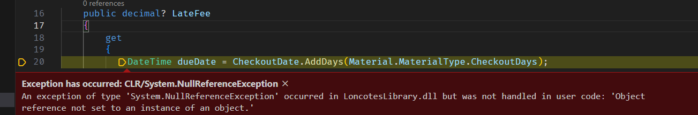

# Calculating Late Fees
In this chapter you will use calculated properties to calculate the late fee for a returned material

## Instructions
1. Add a private static decimal field to the `CheckoutDto` class called `_lateFeePerDay`,  and set it equal to `.50M`. This will store the amount a patron is charged per day a material is late (50 cents). 
1. Add a calculated property to the `CheckoutDto` class called `LateFee`. Its type should be a nullable decimal. For the logic for this property, see the algorithm below.

## Algorithm
1. If the return date is later than the due date, there will be a fee, based on the number of days it is late. Otherwise, the value should be null:
    ``` 
    if (daysLate > 0)
    {
        //do logic to return fee...
    }
    return null;
    ```
1. To calculate the fee, you need to find out the number of days between the ReturnDate and the dueDate
    ```
    int daysLate = (returnDate - dueDate).Days;
    ```
1. To calculate the due date, you need to add the number of days that the item can be checked out to the checkout date:
    ```
    DateTime dueDate = CheckoutDate.AddDays(Material.MaterialType.CheckoutDays);
    ```
1. The return date will either be the actual date that the material was returned, or if it is `null` we calculate the current accrued fees using today's date. From the [MS docs](https://learn.microsoft.com/en-us/dotnet/csharp/language-reference/operators/null-coalescing-operator): "The null-coalescing operator `??` returns the value of its left-hand operand if it isn't null; otherwise, it evaluates the right-hand operand and returns its result.":
    ``` 
    DateTime returnDate = ReturnDate ?? DateTime.Today;
    ```
1. The actual late fee will be the product of `daysLate` and the `_lateFeePerDay`:
    ``` 
    decimal fee = daysLate * _lateFeePerDay;
1.  Now all that's left is to put it all together:
    ```
    DateTime dueDate = CheckoutDate.AddDays(Material.MaterialType.CheckoutDays);
    DateTime returnDate = ReturnDate ?? DateTime.Today;
    int daysLate = (returnDate - dueDate).Days;
    decimal fee = daysLate * _lateFeePerDay;
    return daysLate > 0 ? fee : null;
    ``` 
    Here we are using a ternary instead of `if`/`else` to either return the fee if it was/is late, or null if it is not. 
1. Add this logic to the calculated property. 

## Testing the late fee code
Try the overdue endpoint again, and you should see a `lateFee` property on each of the checkouts for the number of days it is/was late. However, we have now introduced a [_regression_](https://en.wikipedia.org/wiki/Software_regression) into our program. Try out the endpoint that gets a material by id, and make sure that the material id that you choose has checkouts associated with it. When you try the endpoint, your API should throw an exception that looks like this: 


Why is this happening?

The heart of the problem is that when we created the `api/materials/{id}` endpoint, we did not anticipate that the `CheckoutDto` would always need to have its `Material` and `Material.MaterialType` properties set to a value. After all, in that endpoint's data result, the checkouts are nested inside the `Material` property, so the `Material` and `MaterialType` data is already present, and is the same for every checkout nested inside the material object.

However, once we added a property to the `CheckoutDto` that is expecting to be able to access the checkout's `Material` and `Material.MaterialType` properties, every time our program tries to serialize a `CheckoutDto` to JSON, it will try to access the `LateFee` property to put the value in the output data. `LateFee` expects the `Material.MaterialType` for the checkout to have a value, but we're not always setting those. 

So what can we do?

The answer to this question depends largely on what data we want and need to return to the client for these different use cases. Here are some options for this example:
 
1. If, when getting a material by id with its checkouts, the late fee information is relevant (like, for example, the client consuming this API wants to show the late fee in the component that uses this data).  In that case, we should add the `Material` and `MaterialType` properties to each `CheckoutDto` for the material. This will duplicate a lot of data, but that's ok!
1. On the other hand, you might want to present the checkout data to the client differently for different endpoints. If that is the case, we should create separate DTOs for each of the ways that we want to present the data that we get from the database. This option shows the real advantage of using DTOs: We can create as many classes as we want to describe how the data will look to the client, and this allows us to avoid introducing the kind of regression we saw in the exception above.

### Creating a `CheckoutWithLateFeeDto`
Let's implement the second option above by creating another DTO to represent the checkout data that includes the late fees.

1. Create another DTO, identical in all but name to the `CheckoutDto` class called `CheckoutWithLateFeeDto`.
1. Switch the class that the overdue endpoint is using from `CheckoutDto` to `CheckoutWithLateFeeDto`
1. Remove the `_lateFeePerDay` field and the `LateFee` property from the `CheckoutDto` class.
1. Restart your application, and test both of the endpoints. They should both work now!

## Try it for yourself!
Add another calculated property to the `Patron` class called `Balance` that totals up the unpaid fines that a patron owes. Add a `Paid` property of type `bool` to the `Checkout` class that indicates whether a fee has been paid or not. Try to use the method in this and the previous chapters to break the problem down. Start with a description of the problem, and then pseudo-code. Slowly turn parts of the pseudo-code into actual code as you figure out how to solve each piece. 

Up Next: [Adding a React Client](./loncotes-client.md)