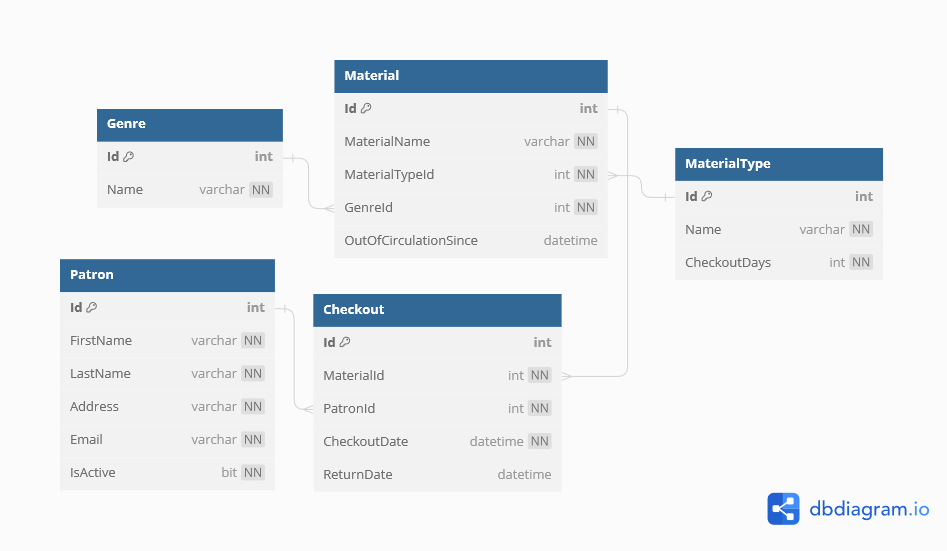

# :book: Loncotes County Library
The Loncotes County Library has hired us to build a new web application to manage their patrons, materials, and checkouts. We will be building the app to be used with their existing database, but you will need to create your own for local development based on the data model of the library's. Eventually, the app will be used by patrons and librarians, but a pilot program for the first version will only be used by the librarians.  

This is the ERD for the library's database:

## Setting up the project
1. Use the instructions from the Creek River Project to create a new web api project called `LoncotesLibrary`, with a database called `LoncotesLibrary`.
1. Use the ERD to create models for the application. Remember that nullable types that are marked as `NOT NULL` (`NN` on this ERD image) require the `[Required]` attribute to be not nullable when you run the database migration. Also remember that nullable `DateTime`s should have the type `DateTime?`.
1. Use _composition_ to add properties to the models that store related data. For example: A checkout has a `MaterialId` property for the foreign key. Add a `Material` property to store the related data associated with that foreign key.
1. Use the [DbContext chapter](./creek-river-db-context.md) from Creek River as a guide to creating the `LoncotesLibraryDbContext` class (this class needs to _inherit_ the `DbContext` class), as well as adding the configuration to `Program.cs` to use EF Core and Npgsql. 
1. Use `OnModelCreating` to seed the database. 
    - Have at least 3 material types (book, periodical, CD, etc...) `CheckoutDays` represents the number of days the material can be checked out before it is overdue. 
    - At least 2 Patrons
    - At least 5 Genres (SciFi, History, etc...)
    - At least 10 Materials
    - You do not need to have any checkouts initially. 
1. Once the configuration and `LoncotesCountyDbContext` class are correct (be careful about copy-paste without updating the code correctly!), you can create the initial migration and create the database with the terminal commands. 

Up Next: [Basic Features](./loncotes-basic-features.md)