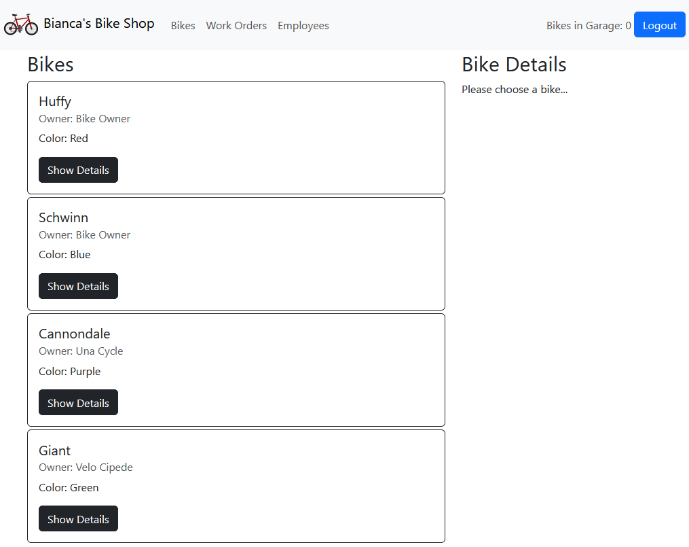
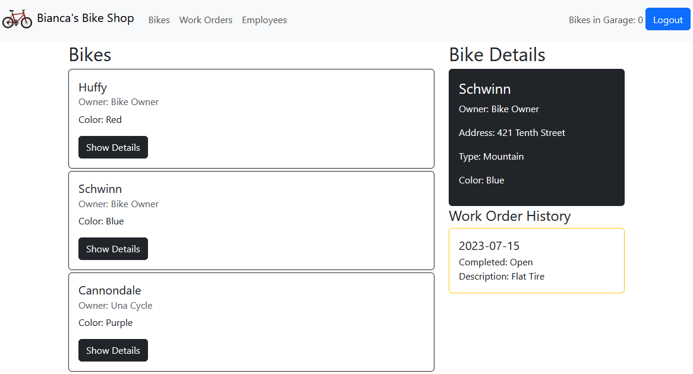

# Displaying Bikes 
In this chapter you will complete a feature to show a list of Bikes on the home page, as well as a bike's details when it is selected. 

## Display All Bikes

### The API enpdoint
The `BikeList` component should display a list of bikes, each represented by a `BikeCard`. Let's investigate the `BikeCard` component to see what kind of data it is expecting:
``` jsx
<Card color="dark" outline style={{ marginBottom: "4px" }}>
      <CardBody>
        <CardTitle tag="h5">{bike.brand}</CardTitle>
        <CardSubtitle className="mb-2 text-muted" tag="h6">
          Owner: {bike.owner.name}
        </CardSubtitle>
        <CardText>Color: {bike.color}</CardText>
        <Button
          color="dark"
          onClick={() => {
            setDetailsBikeId(bike.id);
            window.scrollTo({
              top: 0,
              left: 0,
              behavior: "smooth",
            });
          }}
        >
          Show Details
        </Button>
      </CardBody>
    </Card>
```
It appears that in addition to the bike data, it is expecting the `owner` to be present as well: `bike.owner.name`

Let's update the endpoint in the API to include the owner when getting all bikes:
>BikeController.cs
``` csharp
[HttpGet]
//[Authorize]
public IActionResult Get()
{
    return Ok(_dbContext.Bikes.Include(b => b.Owner).ToList());
}
```
The `Authorize` attribute is commented out for now, so that we can test the method in Postman without logging in. Test the method to see that the bike objects now include their owners. Once you have confirmed that the endpoint works, _uncomment_ the `Authorize` attribute to ensure that only logged in users will be able to access it. 

### Accessing the API from React
We need to implement the `getBikes` function in the `bikeManager` module to use in the `BikeList` component:
>bikeManager.js
``` javascript
export const getBikes = () => {
  return fetch(apiUrl).then((res) => res.json());
};
```
Now we need to implement the `getAllBikes` function in the `BikeList` component:
``` javascript
 const getAllBikes = () => {
    getBikes().then(setBikes);
  };
```
### Adding `BikeCard`s to `BikeList`
Finally, we need to update the JSX in `BikeList` to use the data we are receiving from the API using the `BikeCard` component and `map`:
``` jsx
<>
    <h2>Bikes</h2>
    {bikes.map((bike) => (
    <BikeCard
        bike={bike}
        setDetailsBikeId={setDetailsBikeId}
        key={bike.id}
    ></BikeCard>
    ))}
</>
```
Test the solution by logging in. If everything is set up correctly you should see this screen:


## Display Bike Details

### Add an API method
Let's examine the `BikeDetails` component to see what data it is expecting:
``` jsx
<>
    <h2>Bike Details</h2>
    <Card color="dark" inverse>
    <CardBody>
        <CardTitle tag="h4">{bike.brand}</CardTitle>
        <p>Owner: {bike.owner.name}</p>
        <p>Address: {bike.owner.address}</p>
        <p>Type: {bike.bikeType.name}</p>
        <p>Color: {bike.color}</p>
    </CardBody>
    </Card>
    <h4>Work Order History</h4>
    {bike.workOrders.map((wo) => (
    <Card
        outline
        color="warning"
        key={wo.id}
        style={{ marginBottom: "4px" }}
    >
        <CardBody>
        <CardTitle tag="h5">{wo.dateInitiated.split("T")[0]}</CardTitle>
        <CardSubtitle>
            Completed:{" "}
            {wo.dateCompleted ? wo.dateCompleted.split("T")[0] : "Open"}
        </CardSubtitle>
        <CardText>Description: {wo.description}</CardText>
        </CardBody>
    </Card>
    ))}
</>
```
In addition to the `owner`, this component is expecting the `bike` to have a `bikeType` and `workOrders`. 

Let's add an endpoint to the `BikeController` to provide this data:
>BikeController.cs
``` csharp
[HttpGet("{id}")]
[Authorize]
public IActionResult GetById(int id)
{
    Bike bike = _dbContext
        .Bikes
        .Include(b => b.Owner)
        .Include(b => b.BikeType)
        .Include(b => b.WorkOrders)
        .SingleOrDefault(b => b.Id == id);

    if (bike == null)
    {
        return NotFound();
    }

    return Ok(bike);
}
```
Some things to notice:
1. `"{id}"` has been passed into `HttpGet` to add more to the route that this handler should map to. Because the controller's route is already `/api/bike`, adding `{id}` will make the whole route for this endpoint be `/api/bike/{id}`. Just like when we were using Minimal APIs, the name inside the `{}` _must_ match the `int id` param in the method in order for the framework to pass the value in from the URL when calling it. 
1. The name of the method is somewhat arbitrary. The way that the framework figures out which method to call is through the route mapping that is provided in the `Route` and `HttpGet` attributes.    


Comment out the `Authorize` attribute to test the endpoint in Postman before moving on (remember to uncomment it after testing). 

### Accessing the API from React

Add the `getBikeById` function to the `bikeManager` module:
``` javascript
export const getBikeById = (id) => {
  return fetch(`${apiUrl}/${id}`).then((res) => res.json());
};
```
And finally use it in the `BikeDetails` component:
``` javascript
 const getBikeDetails = (id) => {
    getBikeById(id).then(setBike);
  };
```
Test the functionality of the app. Click on the details buttons for a few bikes. You should see this if everything is working correctly:
 

Up Next: [Bikes in Garage](./biancas-bikes-in-garage.md)

## ✍️ Reflections
Think about the process we went through to add each of these features:
1. Create (or examine an existing) UI component. 
1. Discover its data needs
1. Create an API endpoint that meets those needs, if it doesn't already exist, or update an existing one to do so. 
1. Access that endpoint from the data access module in the front end
1. Use the data access module to get the data into the component that needs it. 

You can use this process to build every feature that you add to your own applications. 