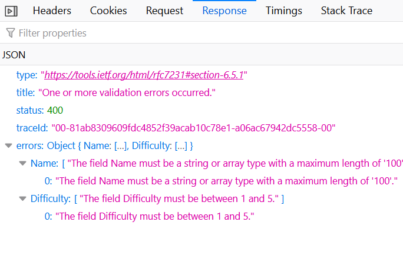

# Data Validation with Data Annotations
In this chapter we will use Data Annotations to:
1. Restrict Chore name to a maximum length of 100 characters
1. Restrict Chore difficulties to a range of 1-5
1. Validate a user's registration information

## Using the `DataAnnotations` namespace
The attributes you will be using in this chapter come from the `System.ComponentModel.DataAnnotations`, so you will need to add a `using` directive for that namespace in each file in which you wish to use them. 

## Maximum Length for Chore Names
The class definition for `Chore` and `ChoreDto` should look something like this up to this point:
>Chore.cs
``` csharp
namespace HouseRules.Models;

public class Chore
{
    public int Id { get; set; }
    public string Name { get; set; }
    public int Difficulty { get; set; }
    public int ChoreFrequencyDays { get; set; }
    public List<ChoreAssignment> ChoreAssignments { get; set; }
    public List<ChoreCompletion> ChoreCompletions { get; set; }
}
```
You can use the `MaxLength` Attribute to limit the length of `Chore` and `ChoreDto` names by adding it to the property like this:
``` csharp
[MaxLength(100)]
public string Name { get; set; }
```
You can also describe a range for numeric values:
``` csharp
[Range(1,5)]
public int Difficulty { get; set; }
```

Restart your API when you have made these updates (if it was already running) and test out these validators. Try to add chores with very long names or with difficulties that are too high. The API should return a `400 Bad Request` response, and the chore will not be added to the database. 

## Giving the User Feedback
While it is good to protect our database from data that we don't want, it is a better UX to give the user feedback that their attempt failed, and why. 

If you look at one of the failed `POST` HTTP requests in the dev tools, you can see that the API actually sends back meaningful feedback with validation error messages:



We can use these messages in the front end, but first, at least one of these messages isn't very useful. Your users might not (probably don't actually) know what an "array type" is, so let's define a better message in the `Chore` class like this:
``` csharp
[MaxLength(100, ErrorMessage = "Chore names must be 100 characters or less")]
public string Name { get; set; }
```
### Displaying Errors to the User
Now that the error message is more helpful, you can update the handler to check for the 400 response, and act accordingly:

1. Add a state variable called `errors` to the `CreateChore` component
1. Update the handler to check for an `errors` property in the response. If it is there, then set the `errors` state variable to the value of the response's `errors` value. Your code might look different, but here is an example:
    ``` javascript
    const handleCreateChore = (evt) => {
        evt.preventDefault();
        const newChore = {
        name,
        difficulty,
        choreFrequencyDays,
        };
        createChore(newChore).then((res) => {
        if (res.errors) {
            setErrors(res.errors);
        } else {
            navigate("/chores");
        }
        });
    };
    ```
1. All that is left is to create some UI elements that will display the errors when they are set:
    ```jsx
    <div style={{ color: "red" }}>
        {Object.keys(errors).map((key) => (
            <p key={key}>
            {key}: {errors[key].join(",")}
            </p>
        ))}
    </div>
    ```
    At this point in the course, though you haven't necessarily been shown code like this, you should be able to figure out what each part of it is doing. Look up `Object.keys` and `join` if you forget what those do in Javascript. Ask an instructor if any of the code here is unclear. 
1. Test the form again to make sure you get appropriate feedback for bad input. 

## Practice
1. Update the `Chore` class and the `CreateChore` component to enforce a minimum `ChoreFrequencyDays` of 1, and a maximum of 14
    - bonus challenge: use the [datalist](https://developer.mozilla.org/en-US/docs/Web/HTML/Element/input/number#offering_suggested_values) element to suggest 1,3,7,10, and 14 as options (note that this will have no effect on the allowed values on the server side)
1. Use the `EmailAddress` data annotation to validate that a registering user has input a valid email for their registration, and use the `MaxLength` attribute to ensure that the username submitted is less than 50 characters.
1. You have already seen the `Required` data annotation used in data models to make nullable types `NOT NULL` in the database. You can also use `Required` to make data properties required when submitted to the API. Try adding it to properties on the Chore and Registration models to further improve model validation for these types. 

Up Next: [More features for House Rules](./house-rules-more-features.md)

## 🔍 Additional Materials
1. [ Available Data Annotations](https://learn.microsoft.com/en-us/dotnet/api/system.componentmodel.dataannotations?view=net-8.0)