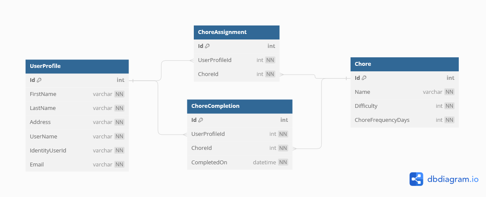

# Creating the Data Model
In this chapter we will create the Models classes for House Rules, add code to `OnModelCreating` so that the database will be seeded with starting data, finally build the database. 

## ERD for House Rules
You haven't been given user stories or wireframes for this project, but here is the ERD representing the data model for the system: 

Use this ERD to create classes in the `Models` folder to match. Remember to use _composition_ to add `List` or single object properties to represent related data. For example, the `Chore` class will need a `List<ChoreCompletion>` property to allow getting all related `ChoreCompletion` objects, and `ChoreAssignment` will require a `Chore` property in order get related chore data. 

## Create Seed Data
Use the `OnModelCreating` method in the `HouseRulesDbContext` class to add data to the database when it is created. There should already be code for creating an Admin role, an admin `IdentityUser`, and giving that `IdentityUser` the role of `Admin` with a row in `UserRoles`. Add to that:
1. At least five chores (The difficulty can be between 1 and 5, though you can choose a different range if you like. `ChoreFrequencyDays` represents how often, in days, a chore should be completed. For example, "Mow the Lawn" needs to get done every 14 days, and has a difficult of 4). 
1. At least two `ChoreAssignment`s. These represent the chores a user is currently assigned. You can just assign them to the one admin user that will be created when the database is created. 
1. At least one `ChoreCompletion`. These represent individual completions of a chore, and can be completed by any user, not only users that are assigned that chore. 

## Migrate the Database
Create an initial migration, and then update the database!

Up Next: [Basic Endpoints](./house-rules-basic-endpoints.md)